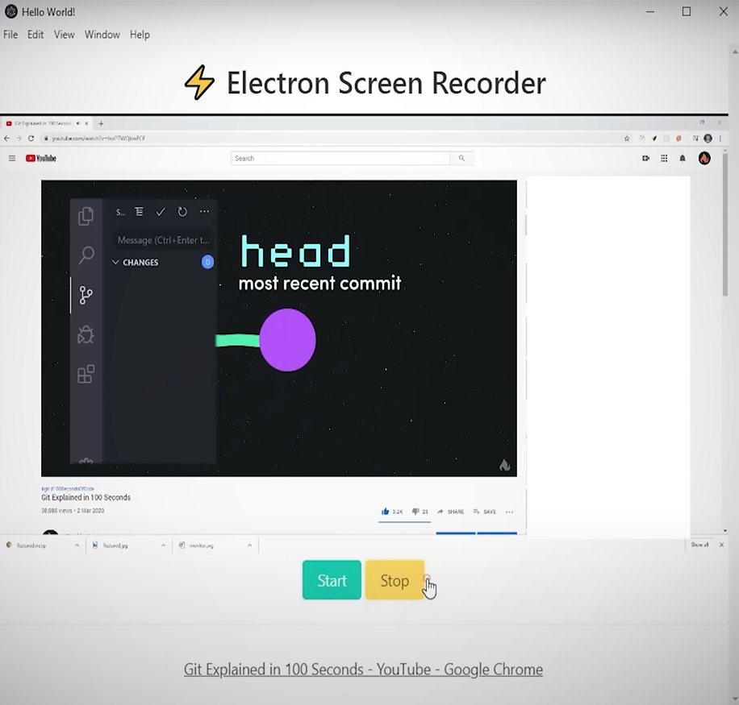

# Screen Magnifier

- Suitable for multiple screens
- Totally can be used with single screen
- Follows mouse cursor
- Easily full screenable
- Escape exits full screen

## Overview

This repository contains the code for a versatile desktop screen recorder built with Electron.js. This application allows users to select their preferred stream or window for recording. Compatible and easily installable across multiple platforms including Mac, Windows, and Linux. Perfect for capturing your screen activities with ease and precision.

## Setup

To run this project locally, follow these steps:

1. Run `npm i` to install packages
2. Run `npm start` to start virtual app window
3. Run  `rs` to update app state
4. Run `npm run make` to build the app

## Contributing

While this is a personal project, I'm open to collaboration. If you have suggestions for improvements, please open an issue.

## License

This project is licensed under the MIT License - see the [LICENSE](LICENSE) file for details.

 
